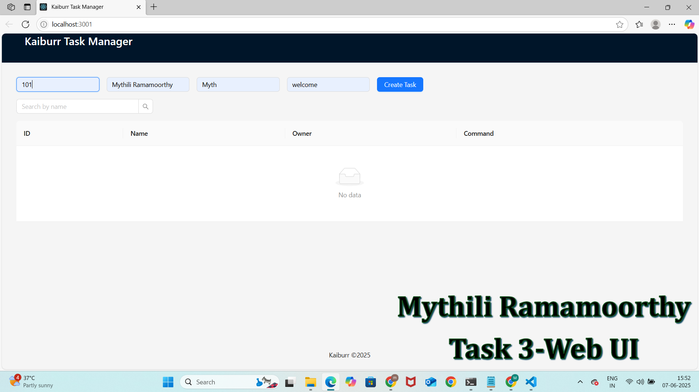

#  Kaiburr Task 3 
This project is a full-stack **Task Manager application** built using:

- ✅ Backend: Java Spring Boot (REST API)
- ✅ Frontend: React
- ✅ CI/CD: GitHub Actions

---

## Folder Structure

kaiburr-task3/
├── backend/ # Java Spring Boot application
│ └── src/
│ └── main/java/com/example/taskmanager/...
│ └── pom.xml
├── frontend/ # React frontend
│ └── src/App.js
│ └── package.json
└── .github/workflows/ci.yml # GitHub Actions CI pipeline

yaml
Copy
Edit

---

##  Features

- Add & delete tasks from a task list
- REST API: `GET`, `POST`, `DELETE` tasks
- In-memory H2 database (for testing)
- CORS-enabled backend for fron[text](../kaiburr-task4-ci/.github)tend integration
- GitHub Actions pipeline for CI

---

## Backend Setup (Spring Boot)

###  Prerequisites:
- Java 17+
- Maven

### How to Run:

1. Navigate to the `backend` folder:
   ```bash
   cd backend
Run the Spring Boot app:

bash
Copy
Edit
mvn spring-boot:run
Verify it's running at:


output:
UI


